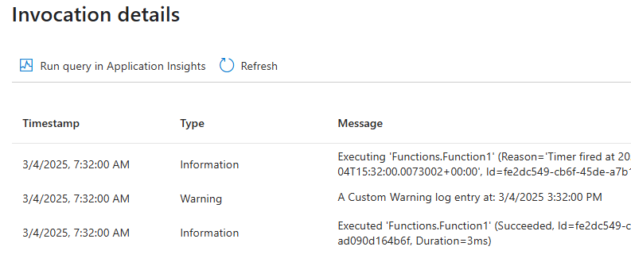
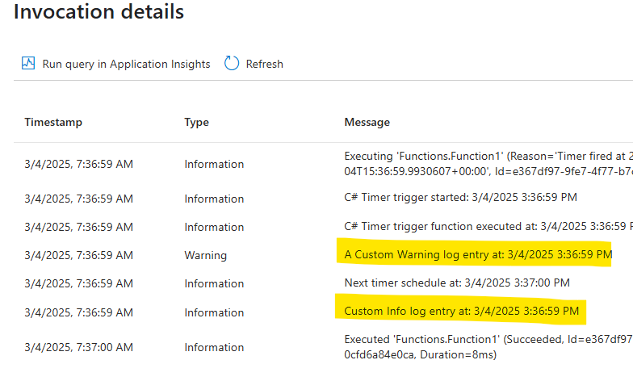

# Dotnet Isolated function app with Application Insights logging from worker.

This is a sample app which demonstrates how to use Application Insights logging in a .NET isolated function app. It shows the change needed in starup code to enable certain log levels.

The Application Insights SDK adds a default logging filter that instructs ILogger to capture only Warning and more severe logs. Application Insights requires an explicit override.
Log levels can also be configured using appsettings.json. For more information, see https://learn.microsoft.com/en-us/azure/azure-monitor/app/worker-service#ilogger-logs


If you deploy this version of code, you will see only limited logs in the invocation logs. The logs are filtered out by the Application Insights SDK.



To fix the issue, uncomment the below part of the code in the startup code.
```

//services.Configure<LoggerFilterOptions>(options =>
//{
//    // The Application Insights SDK adds a default logging filter that instructs ILogger to capture only Warning and more severe logs. Application Insights requires an explicit override.
//    // Log levels can also be configured using appsettings.json. For more information, see https://learn.microsoft.com/en-us/azure/azure-monitor/app/worker-service#ilogger-logs
//    LoggerFilterRule? toRemove = options.Rules.FirstOrDefault(rule => rule.ProviderName
//        == "Microsoft.Extensions.Logging.ApplicationInsights.ApplicationInsightsLoggerProvider");

//    if (toRemove is not null)
//    {
//        options.Rules.Remove(toRemove);
//    }
//});

```
If you deploy this version of code, you should be able to see the invocation logs include the logs


            